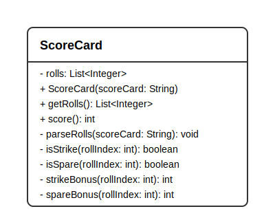

# Bowling Game Java

⚠️ **Créditos**: Este proyecto fue realizado por Jorge también. Todo se hizo en un PC. ⚠️

Esta es una versión en Java del Bowling Kata.

## Descripción

El proyecto contiene una implementación de puntuación de bolos basada en la lógica del kata original de Python.

- `teamrocket.ScoreCard` convierte la entrada del juego en tiros y calcula la puntuación total para 10 frames.

## UML



## Ejecución

Construye y prueba con Maven:

```bash
mvn test
```

Para ejecutar el código desde otra clase, crea un `ScoreCard` y llama a `score()`:

```java
ScoreCard card = new ScoreCard("X7/9-X-88/-6XXX81");
int total = card.score();
```

## Formato de entrada

Los valores válidos son:

- `X` para strike
- `/` para spare
- `-` para fallo (0 pines)
- `0-9` para número de pines

El proyecto acepta espacios en la entrada para mejorar la legibilidad.
